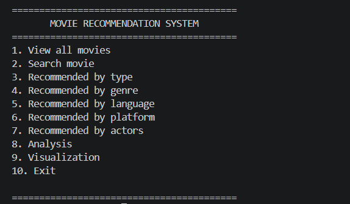
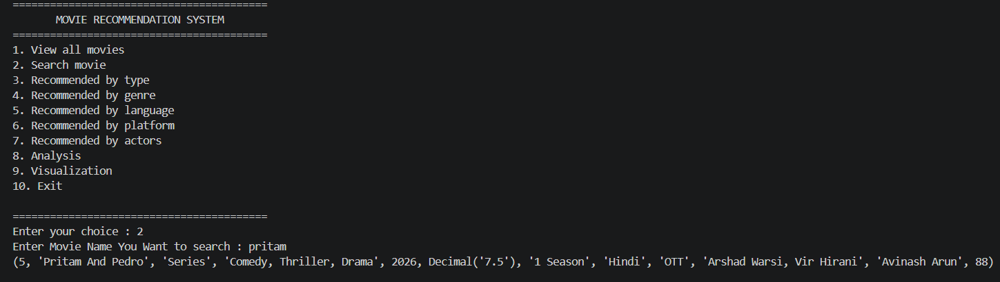
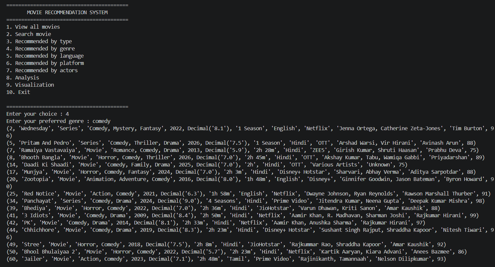
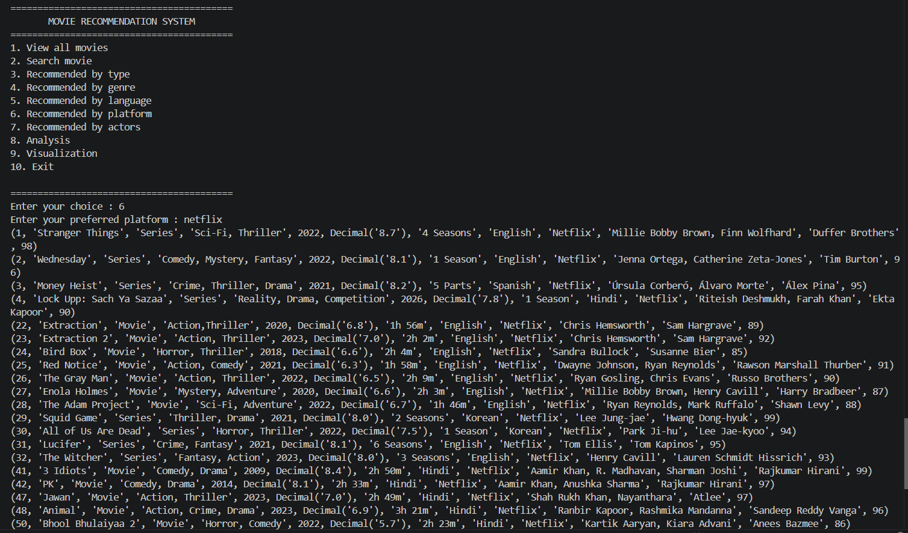
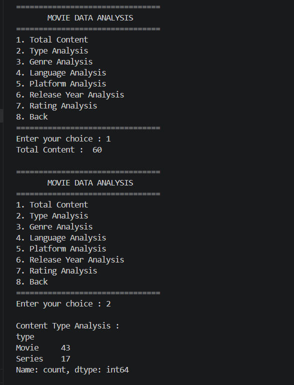
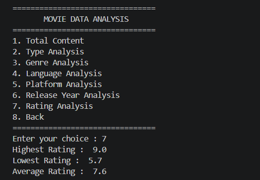
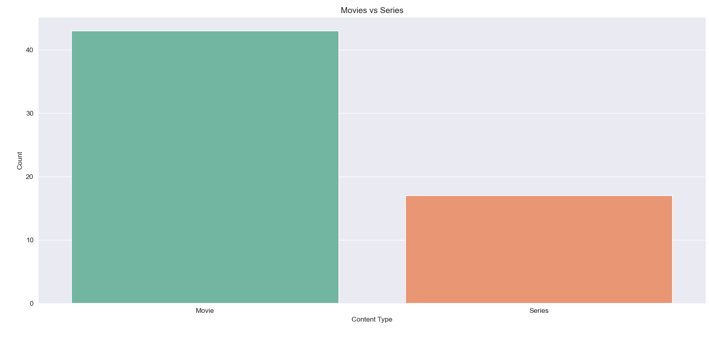
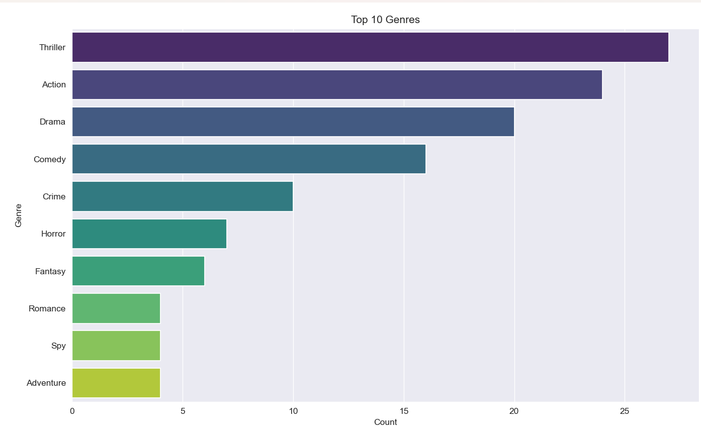

#  Netflix Data Analysis & Recommendation System


A Python-based **Netflix Data Analysis and Movie Recommendation System** that provides movie recommendations, performs data analysis, and visualizes insights using Python libraries. The project uses **MySQL through XAMPP** for storing and managing movie data.

---

##  Features

###  Movie Recommendation
- Search movies by title
- Recommend movies based on:
  - Genre
  - Platform
  - Language
  - Actors
  - Content Type

###  Data Analysis
- Total content analysis
- Movie and series distribution
- Genre analysis
- Language analysis
- Platform analysis
- Release year analysis
- Rating analysis

###  Visualization
- Movies vs Series comparison
- Top 10 genres visualization
- Language distribution
- Platform distribution
- Rating distribution

---

##  Technologies Used

- Python
- MySQL (XAMPP)
- Pandas
- NumPy
- Matplotlib
- Seaborn
- mysql-connector-python

---

## 📂 Project Structure

```
Netflix-Data-Analysis-Recommendation-System/

│
├── main.py
├── db.py
├── recommendation.py
├── analysis.py
├── visualization.py
│
├── requirements.txt
├── README.md
├── .gitignore
│
├── main_menu.png
├── search_movie.png
├── recommendation_genre.png
├── recommendation_platform.png
├── analysis_content_type.png
├── analysis_rating.png
├── visualization_type.png
└── visualization_genre.png
```

---

##  Installation

### Clone the repository

```bash
git clone https://github.com/lakshmi1810-create/Netflix-Data-Analysis-Recommendation-System.git
```

### Install required libraries

```bash
pip install -r requirements.txt
```

---

##  Database Setup

This project uses **MySQL through XAMPP**.

Steps:

1. Start MySQL from XAMPP Control Panel.
2. Open phpMyAdmin.
3. Create database:

```sql
CREATE DATABASE khushi_db;
```

4. Import the database file.
5. Check database configuration in `db.py`.

```python
host="localhost"
user="root"
password=""
database="khushi_db"
```

---

##  How to Run

Run the project using:

```bash
python main.py
```

---

#  Screenshots

## Main Menu



---

#  Recommendation System

## Search Movie



## Recommendation By Genre



## Recommendation By Platform



---

#  Data Analysis

## Total Content & Type Analysis



## Rating Analysis



---

#  Data Visualization

## Movies vs Series



## Top 10 Genres



---

##  Modules Description

| File | Description |
|------|-------------|
| main.py | Main application flow |
| db.py | MySQL database connection |
| recommendation.py | Movie search and recommendation features |
| analysis.py | Data analysis functions |
| visualization.py | Data visualization functions |

---

##  Future Enhancements

- GUI using Tkinter
- Flask/Django web application
- Machine Learning recommendation system
- User authentication
- Personalized watchlist

---

##  Author

**Lakshmi Chauhan**

Python Developer | Data Analytics Enthusiast

---

⭐ If you like this project, consider giving this repository a star!
